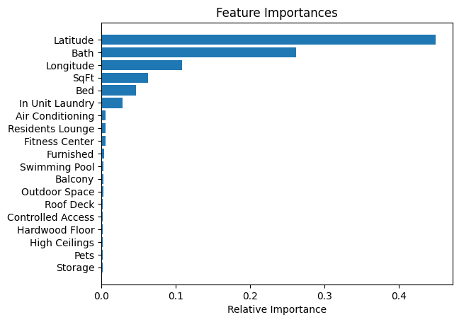
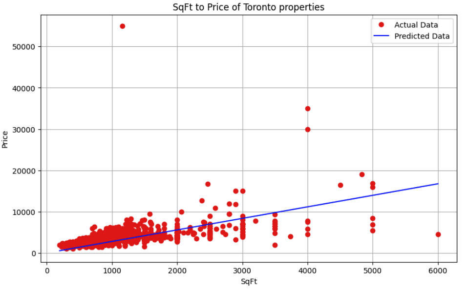
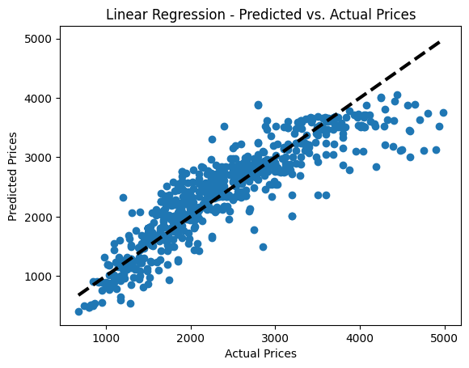
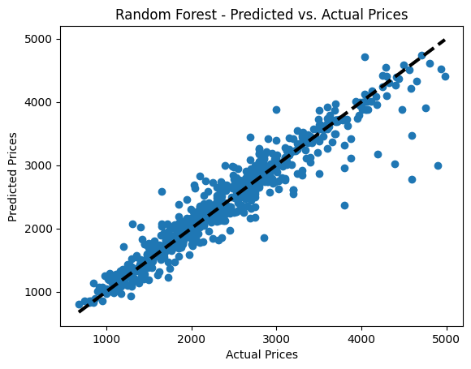

# Real-Estate-Scraper

This project runs on [Python 3](https://www.python.org/downloads/). Make sure you have a version of Python 3 installed.

## Overview









## Setup

### Installing `chromedriver`

Make sure [homebrew](https://brew.sh/) is installed, then run:

```bash
brew install chromedriver 
```

Next get the installation path:

```bash
which chromedriver
```

If you see the error `"Google Chrome for Testing.app is damaged and can’t be opened. You should move it to the Trash."`, run the following:

```bash
xattr -cr 'Google Chrome for Testing.app'
```

### Setup environment

In the project directory, start by creating and activating a virtual environment:

```bash
python -m venv env # create virtual env named env
source env/bin/activate # activate it
```

Then install all the project requirements:

```bash
pip install -r requirements.txt
```

Now create a `.env` file in the root directory. Define the following variable in your `.env` file replacing `YOUR_INSTALLATION_PATH` with your `chromedriver` installation path.

```bash
CHROMEDRIVER_PATH=YOUR_INSTALLATION_PATH
```

### Running the project

You can start the project by running `main.py`.
